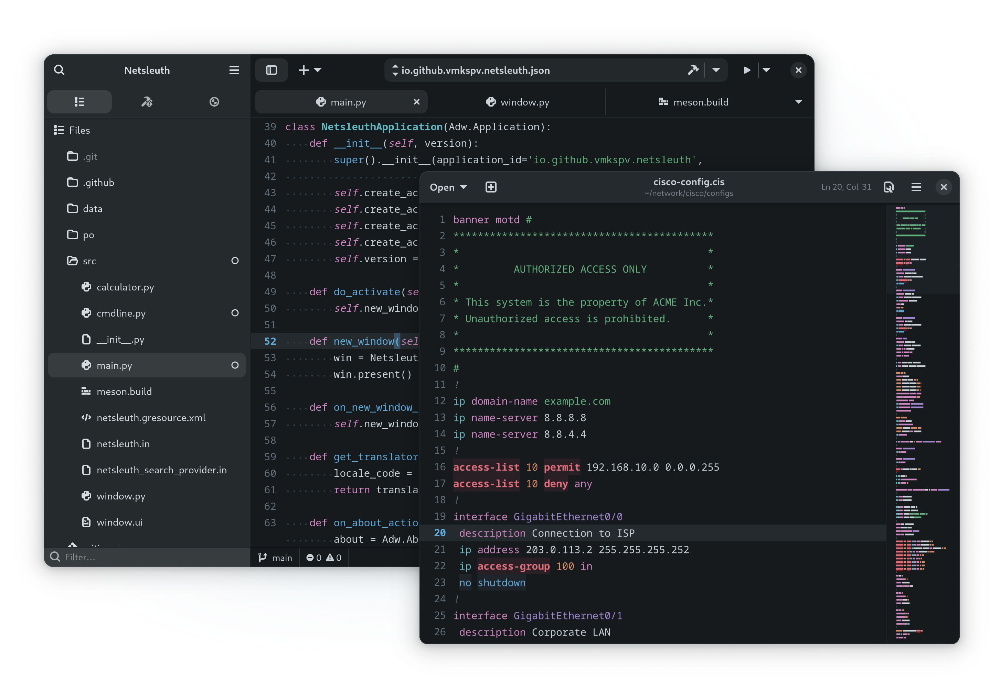

<div align="center">
  
  <h1>Zenith Theme for GtkSourceView</h1>
  <p>
    <strong>A refined dark theme with cohesive colors and complete UI coverage</strong>
    <br>
    <i>This is a GTK adaptation of the <a href="https://marketplace.visualstudio.com/items?itemName=britown.vscode-theme-zenith">Zenith</a> VS Code theme with custom language definitions.</i>
    
  </p>
</div>

## Overview

Zenith is a refined dark theme that offers cohesive colors and comprehensive syntax highlighting support for GTK-based text editors using [GtkSourceView 5](https://wiki.gnome.org/Projects/GtkSourceView). The theme providing optimal readability with balanced contrast and semantic color assignments, making it great for long coding sessions.

Beyond the theme itself, this project includes custom language definitions for infrastructure configuration files, designed to streamline workflows for DevOps engineers and IT administrators.

The repository contains:

1. A GtkSourceView 5 theme ([zenith.xml](gtksourceview-5/styles/zenith.xml)) with a carefully curated color palette.
2. Custom language definitions not included in the GtkSourceView 5 package:
   - [`nginx.lang`](gtksourceview-5/language-specs/nginx.lang): syntax highlighting for Nginx configuration files;
   - [`cisco.lang`](gtksourceview-5/language-specs/cisco.lang): syntax highlighting for Cisco IOS/IOS XE/NX-OS configuration files;
   - [`fstab.lang`](gtksourceview-5/language-specs/fstab.lang): syntax highlighting for filesystem table (fstab) configuration file.

## Installation

You can install the Zenith theme and language definitions using a script:

```bash
curl -fsSL https://raw.githubusercontent.com/vmkspv/zenith-theme-gtk/main/install.sh | bash -s -- --full
```

### Script options

Use the `--theme` or `--langs` flags to install only required components:

```bash
# Install the Zenith theme only
curl -fsSL https://raw.githubusercontent.com/vmkspv/zenith-theme-gtk/main/install.sh | bash -s -- --theme

# Install language definitions only
curl -fsSL https://raw.githubusercontent.com/vmkspv/zenith-theme-gtk/main/install.sh | bash -s -- --langs
```

## Color palette

| Element           | Color   | Usage                                 |
|-------------------|---------|---------------------------------------|
| Background        | #161a1d | Editor background                     |
| Text              | #cbd1d6 | Default text color                    |
| Comments          | #637079 | Comments and documentation            |
| Keywords          | #cf86c1 | Language keywords and control flow    |
| Strings           | #64b280 | String literals                       |
| Numbers           | #d68c67 | Numeric literals                      |
| Functions         | #61abda | Function names and declarations       |
| Types             | #65b8c1 | Types, classes, and interfaces        |
| Variables         | #cbd1d6 | Variable names                        |
| Constants         | #d68c67 | Constants and enumeration values      |
| Special Constants | #9d86ce | Special values like null, true, false |
| Errors            | #de6e7c | Error indicators                      |

## Contributing

Contributions are welcome!

If you have an idea, bug report or something else, don’t hesitate to [open an issue](https://github.com/vmkspv/zenith-theme-gtk/issues).

> This project follows the [GNOME Code of Conduct](https://conduct.gnome.org).

## License

Zenith Theme for GtkSourceView is released under the [MIT License](LICENSE).

The color scheme is adapted from the [Zenith Theme for VS Code](https://github.com/bkuzmanoski/vscode-theme-zenith) by Brian Kuzmanoski.
